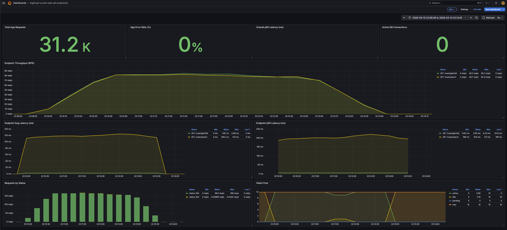
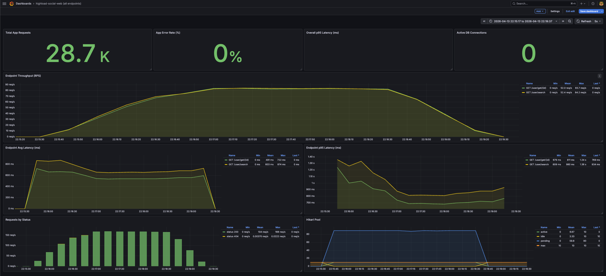
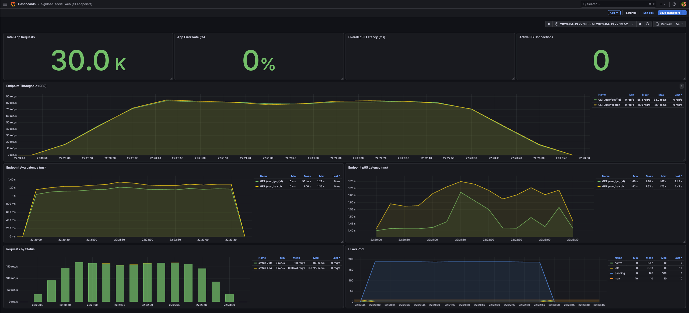

# Отчет по ДЗ 3
## Репликация: практическое применение

## 1. Исходные данные

### Цель текущего этапа

На текущем этапе выполнено baseline-нагрузочное тестирование **до** внедрения `master/slave`-репликации.

Цель этого этапа:

- зафиксировать поведение приложения на одной БД;
- получить точку сравнения `before / after`;
- сохранить артефакты до внедрения read/write split.

### Объем данных

- таблица `highload_social_web.users`: `1 000 000` записей;
- PostgreSQL: single-node режим;
- нагрузочное тестирование: `k6`;
- тип нагрузки: mixed read workload.

### Сценарий нагрузки

Используется смешанный сценарий чтения:

- `GET /user/get/{id}` с выбором случайного `id` в диапазоне `1..999999`;
- `GET /user/search` по dataset из `12` пар префиксов;
- соотношение запросов:
  - `USER_GET_RATIO=0.5`
  - `USER_SEARCH_RATIO=0.5`

### Используемая команда

```bash
bash run-mixed-read.sh <vus> 3m
```

### Выполненные прогоны

```bash
bash run-mixed-read.sh 10 3m
bash run-mixed-read.sh 100 3m
bash run-mixed-read.sh 500 3m
```

### Подробные результаты k6

[Подробный отчет k6](./3-k6-results.md)

---

## 2. Нагрузочное тестирование до master/slave

### Скриншоты из Grafana

#### 10 VU


#### 100 VU


#### 500 VU


### Краткие результаты baseline

#### Общие результаты mixed read test

| VU | Duration | Complete iterations | Throughput, req/s | Error rate, % | Checks rate, % | JSON |
|---:|---:|---:|---:|---:|---:|---|
| 10 | `3m` | 29393 | 163.22 | 0.0068 | 99.9966 | [JSON](./k6/results/mixed-read-10vus-3m-20260413-220945.json) |
| 100 | `3m` | 28172 | 155.93 | 0.0035 | 99.9982 | [JSON](./k6/results/mixed-read-100vus-3m-20260413-221526.json) |
| 500 | `3m` | 29963 | 163.66 | 0.0067 | 99.9967 | [JSON](./k6/results/mixed-read-500vus-3m-20260413-221943.json) |

#### Метрики `GET /user/get/{id}`

| VU | Avg latency, ms | P95 latency, ms | Max latency, ms | Threshold `p95 < 500 ms` |
|---:|---:|---:|---:|---|
| 10 | 2.89 | 6.23 | 49.09 | passed |
| 100 | 577.16 | 795.83 | 2426.86 | failed |
| 500 | 2972.84 | 3470.34 | 5404.82 | failed |

#### Метрики `GET /user/search`

| VU | Avg latency, ms | P95 latency, ms | Max latency, ms | Threshold `p95 < 500 ms` |
|---:|---:|---:|---:|---|
| 10 | 120.02 | 205.32 | 507.39 | passed |
| 100 | 702.29 | 975.23 | 2774.21 | failed |
| 500 | 3081.13 | 3591.57 | 6171.25 | failed |

### Наблюдения по baseline

- при `10 VU` приложение уверенно держит mixed read workload;
- при `100 VU` threshold по `p95 < 500 ms` уже нарушается и для `/user/get/{id}`, и для `/user/search`;
- при `500 VU` обе read-операции деградируют до нескольких секунд по `avg` и `p95`;
- throughput при `10 / 100 / 500 VU` остается в одном диапазоне около `156-164 req/s`, что похоже на достижение предела single-node конфигурации;
- error rate при этом остается очень низким, то есть основная проблема — именно latency, а не массовые ошибки ответов.

---

## 3. Текущий статус по ДЗ

### Что уже сделано

- подготовлен mixed read `k6`-сценарий;
- выполнены baseline-прогоны до репликации;
- сохранены JSON-артефакты прогонов;
- добавлены Grafana screenshots;
- создан dashboard для всех endpoint-ов.

### Что еще не заполнено в отчете

- результаты после внедрения `master/slave`;
- подтверждение, что read-only запросы ушли на slave;
- сравнение `before / after`;
- настройка quorum synchronous replication;
- failover-эксперимент и проверка потери / непотери транзакций.

---

## 4. Промежуточный вывод

Baseline до внедрения `master/slave` зафиксирован. На single-node PostgreSQL система справляется с умеренной mixed read нагрузкой на `10 VU`, но уже на `100 VU` и выше latency заметно растет, а `p95` выходит за целевой порог `500 ms` и для `/user/get/{id}`, и для `/user/search`.

Следующий этап — внедрить read/write split и replication topology, затем повторить **тот же самый** mixed read test и сравнить результаты с текущим baseline.
