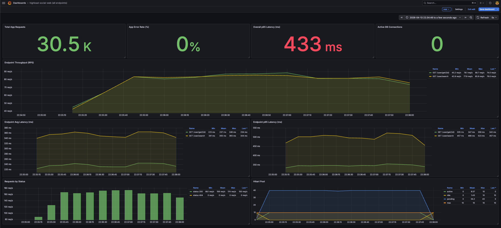
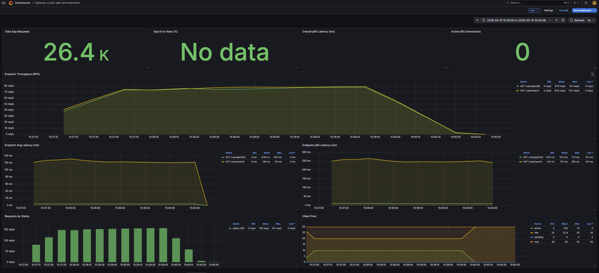
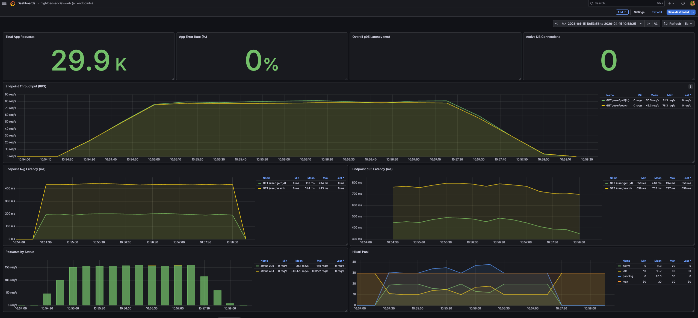
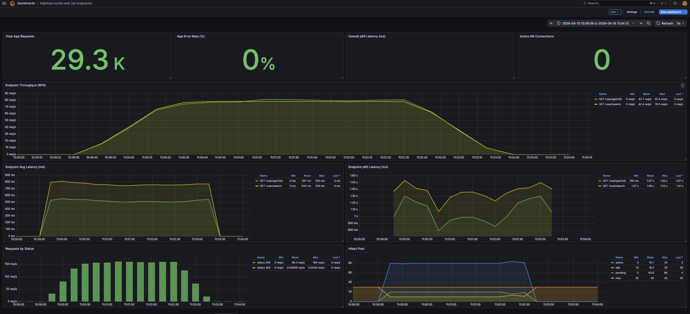
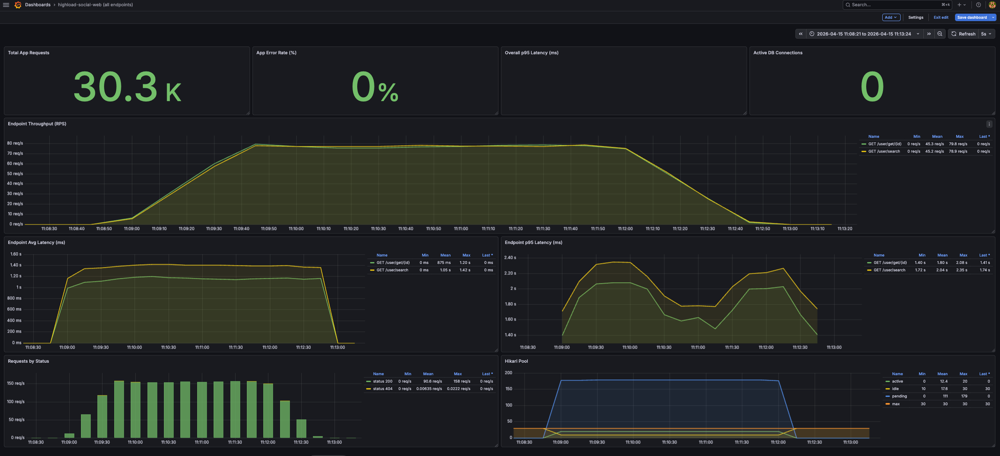
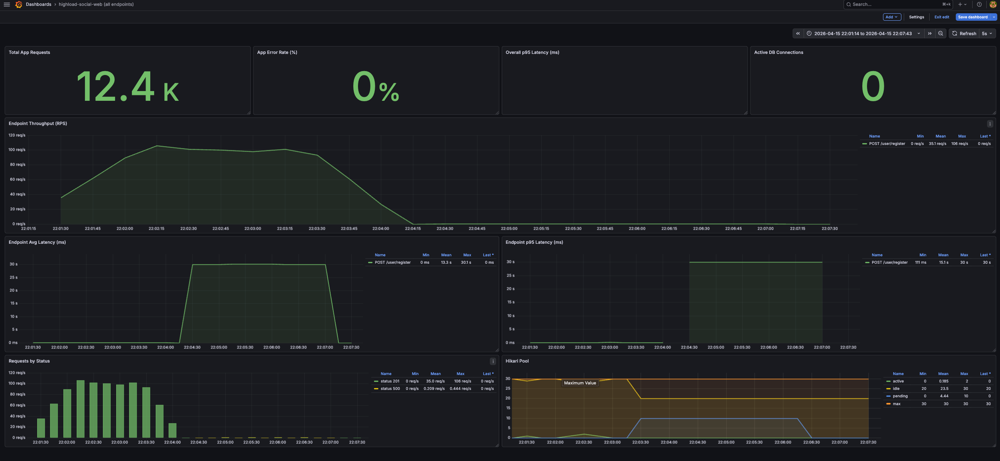

# Отчет по ДЗ 3
## Репликация: практическое применение

## 1. Цель работы

Цель работы — настроить PostgreSQL streaming replication, подключить backend-приложение к реплицированной БД и сравнить производительность чтения до и после переноса `read-only` запросов на реплики.

В рамках текущего этапа выполнено:

- baseline-нагрузочное тестирование на одной PostgreSQL;
- настройка `1 primary + 2 replicas`;
- включение потоковой репликации;
- настройка backend-приложения на read/write split;
- повторное нагрузочное тестирование после перехода на реплики;
- сравнение результатов `before / after`;
- настройка quorum synchronous replication;
- проверка отказа primary под write-нагрузкой;
- promotion самой свежей реплики и переключение второй реплики на новый primary.

---

## 2. Тестовые данные и сценарий нагрузки

### Объем данных

- таблица `highload_social_web.users`: `1 000 000` записей;
- нагрузочное тестирование: `k6`;
- тип нагрузки: mixed read workload;
- длительность каждого прогона: `3m`.

### Сценарий нагрузки

Используется смешанный сценарий чтения:

- `GET /user/get/{id}` с выбором случайного `id` в диапазоне `1..999999`;
- `GET /user/search` по dataset из `12` пар префиксов;
- соотношение запросов:
  - `USER_GET_RATIO=0.5`
  - `USER_SEARCH_RATIO=0.5`

### Используемая команда

```bash
bash run-mixed-read.sh <vus> 3m
```

### Выполненные прогоны

```bash
bash run-mixed-read.sh 10 3m
bash run-mixed-read.sh 50 3m
bash run-mixed-read.sh 100 3m
bash run-mixed-read.sh 500 3m
```

Подробные результаты k6 вынесены в отдельный файл: [3-k6-results.md](./3-k6-results.md).

---

## 3. Настройка репликации

Была настроена topology:

- `primary`: PostgreSQL primary node;
- `replica1`: PostgreSQL standby replica;
- `replica2`: PostgreSQL standby replica.

Для PostgreSQL включены настройки потоковой репликации:

- `wal_level=replica`;
- `max_wal_senders=4`;
- `max_replication_slots=4`;
- `wal_keep_size=256MB`;
- `hot_standby=on`.

Проверка на primary показала две подключенные реплики:

```text
application_name | state     | sync_state
-----------------+-----------+-----------
walreceiver      | streaming | async
walreceiver      | streaming | async
```

Проверка ролей узлов:

```text
primary:  pg_is_in_recovery() = false
replica1: pg_is_in_recovery() = true
replica2: pg_is_in_recovery() = true
```

Итого: потоковая репликация работает, обе реплики находятся в standby-режиме и получают WAL с primary.

---

## 4. Настройка backend-приложения

Backend-приложение настроено на работу с двумя DB-профилями:

- `standard-db` — обычный режим с одной PostgreSQL;
- `primary-replica-db` — режим с `primary + replica1 + replica2`.

В режиме `primary-replica-db` приложение использует отдельные HikariCP pools:

- `primary-pool`;
- `replica1-pool`;
- `replica2-pool`.

Read/write split реализован через `ReadOnlyRoutingDataSource`, который использует `TransactionSynchronizationManager.isCurrentTransactionReadOnly()`:

- `@Transactional(readOnly = true)` отправляется на одну из реплик;
- обычный `@Transactional` отправляется на primary.

Для read-only запросов отмечены:

- `GET /user/get/{id}`;
- `GET /user/search`;
- `POST /login`.

Для write-запросов на primary остается:

- `POST /user/register`;
- генерация тестовых данных.

Flyway явно настроен на primary, чтобы миграции не запускались на replica.

---

## 5. Нагрузочное тестирование до репликации

### Скриншоты из Grafana

#### 10 VU


#### 50 VU


#### 100 VU


#### 500 VU


### Общие результаты mixed read test

| VU | Duration | Complete iterations | Throughput, req/s | Error rate, % | Checks rate, % | JSON |
|---:|---:|---:|---:|---:|---:|---|
| 10 | `3m` | 29393 | 163.22 | 0.0068 | 99.9966 | [JSON](./k6/results/mixed-read-10vus-3m-20260413-220945.json) |
| 50 | `3m` | 30424 | 168.93 | 0.0033 | 99.9984 | [JSON](./k6/results/mixed-read-50vus-3m-20260413-223444.json) |
| 100 | `3m` | 28172 | 155.93 | 0.0035 | 99.9982 | [JSON](./k6/results/mixed-read-100vus-3m-20260413-221526.json) |
| 500 | `3m` | 29963 | 163.66 | 0.0067 | 99.9967 | [JSON](./k6/results/mixed-read-500vus-3m-20260413-221943.json) |

### Метрики `GET /user/get/{id}`

| VU | Avg latency, ms | P95 latency, ms | Max latency, ms | Threshold `p95 < 500 ms` |
|---:|---:|---:|---:|---|
| 10 | 2.89 | 6.23 | 49.09 | passed |
| 50 | 237.20 | 324.06 | 918.90 | passed |
| 100 | 577.16 | 795.83 | 2426.86 | failed |
| 500 | 2972.84 | 3470.34 | 5404.82 | failed |

### Метрики `GET /user/search`

| VU | Avg latency, ms | P95 latency, ms | Max latency, ms | Threshold `p95 < 500 ms` |
|---:|---:|---:|---:|---|
| 10 | 120.02 | 205.32 | 507.39 | passed |
| 50 | 354.47 | 484.10 | 965.87 | passed |
| 100 | 702.29 | 975.23 | 2774.21 | failed |
| 500 | 3081.13 | 3591.57 | 6171.25 | failed |

---

## 6. Нагрузочное тестирование после репликации

### Скриншоты из Grafana

#### 10 VU


#### 50 VU


#### 100 VU


#### 500 VU


### Общие результаты mixed read test

| VU | Duration | Complete iterations | Throughput, req/s | Error rate, % | Checks rate, % | JSON |
|---:|---:|---:|---:|---:|---:|---|
| 10 | `3m` | 27240 | 151.25 | 0.0000 | 100.0000 | [JSON](./k6/results/mixed-read-10vus-3m-20260415-103637.json) |
| 50 | `3m` | 28454 | 157.73 | 0.0070 | 99.9965 | [JSON](./k6/results/mixed-read-50vus-3m-20260415-105407.json) |
| 100 | `3m` | 28104 | 155.61 | 0.0107 | 99.9947 | [JSON](./k6/results/mixed-read-100vus-3m-20260415-105925.json) |
| 500 | `3m` | 28531 | 155.74 | 0.0070 | 99.9965 | [JSON](./k6/results/mixed-read-500vus-3m-20260415-110849.json) |

### Метрики `GET /user/get/{id}`

| VU | Avg latency, ms | P95 latency, ms | Max latency, ms | Threshold `p95 < 500 ms` |
|---:|---:|---:|---:|---|
| 10 | 4.76 | 10.82 | 175.81 | passed |
| 50 | 199.49 | 454.59 | 926.45 | passed |
| 100 | 519.66 | 1057.34 | 2652.47 | failed |
| 500 | 3063.18 | 3819.06 | 5813.61 | failed |

### Метрики `GET /user/search`

| VU | Avg latency, ms | P95 latency, ms | Max latency, ms | Threshold `p95 < 500 ms` |
|---:|---:|---:|---:|---|
| 10 | 126.05 | 253.17 | 713.60 | passed |
| 50 | 436.12 | 767.81 | 1277.74 | failed |
| 100 | 764.08 | 1340.60 | 2674.07 | failed |
| 500 | 3299.08 | 4083.92 | 7132.98 | failed |

---

## 7. Сравнение before / after

### Throughput

| VU | Before, req/s | After, req/s | Изменение |
|---:|---:|---:|---:|
| 10 | 163.22 | 151.25 | -7.33% |
| 50 | 168.93 | 157.73 | -6.63% |
| 100 | 155.93 | 155.61 | -0.21% |
| 500 | 163.66 | 155.74 | -4.84% |

### P95 latency: `GET /user/get/{id}`

| VU | Before, ms | After, ms | Изменение |
|---:|---:|---:|---:|
| 10 | 6.23 | 10.82 | +73.68% |
| 50 | 324.06 | 454.59 | +40.28% |
| 100 | 795.83 | 1057.34 | +32.86% |
| 500 | 3470.34 | 3819.06 | +10.05% |

### P95 latency: `GET /user/search`

| VU | Before, ms | After, ms | Изменение |
|---:|---:|---:|---:|
| 10 | 205.32 | 253.17 | +23.31% |
| 50 | 484.10 | 767.81 | +58.61% |
| 100 | 975.23 | 1340.60 | +37.46% |
| 500 | 3591.57 | 4083.92 | +13.71% |

### Наблюдения

- После перехода на `primary + 2 replicas` latency не улучшилась.
- `GET /user/search` стал хуже на всех уровнях нагрузки.
- `GET /user/get/{id}` местами стал немного лучше по `avg`, но хуже по `p95`, то есть хвостовые задержки выросли.
- Threshold `p95 < 500 ms` после репликации нарушается уже на `50 VU` для `/user/search`, хотя до репликации `50 VU` еще проходил.
- Throughput после репликации стал немного ниже или остался примерно на том же уровне.
- Error rate остается низким, значит основной эффект снова виден именно в latency.

---

## 8. Почему replicated setup оказался хуже

Этот результат не обязательно означает, что репликация настроена неправильно. Для текущего эксперимента есть несколько важных ограничений:

- Все PostgreSQL-инстансы запущены на одной машине, поэтому primary и две replicas конкурируют за один CPU, одну память и один диск.
- Нагрузка почти полностью read-only, поэтому перенос чтения на реплики не разгружает write path и не дает заметного преимущества.
- Каждая replica хранит полный набор данных и выполняет те же тяжелые `search`-запросы, но физически все равно использует ресурсы того же MacBook.
- У каждой ноды свой buffer cache; после разделения нагрузки кэш может быть менее эффективным, чем у одной БД с одним общим cache.
- В replicated setup появляются дополнительные connection pools и сетевые переходы через Docker-порты.
- `/user/search` является более тяжелым endpoint-ом, поэтому он сильнее реагирует на конкуренцию за CPU/IO.

В продакшене реплики обычно находятся на отдельных серверах. В таком окружении read scaling может дать выигрыш, потому что чтение действительно распределяется по разным физическим ресурсам. В локальном Docker-окружении на одной машине репликация чаще показывает архитектурную корректность, а не прирост производительности.

---

## 9. Кворумная синхронная репликация

Для проверки отсутствия потери подтвержденных транзакций при аварии primary была подготовлена quorum synchronous replication.

### Конфигурация

На primary используется конфигурация PostgreSQL:

```text
synchronous_standby_names = ANY 1 (replica1, replica2)
synchronous_commit = on
```

Смысл настройки:

- `ANY 1` означает, что commit должен быть подтвержден любой одной репликой из списка;
- `replica1` и `replica2` являются именами standby-подключений;
- `synchronous_commit = on` означает, что primary не должен подтверждать commit клиенту, пока WAL не будет подтвержден synchronous standby.

Важно: quorum-настройка включается после первичного bootstrap кластера и после того, как обе реплики уже подключились к primary. Если включить `synchronous_standby_names` прямо на старте пустого кластера, initialization может зависнуть, потому что primary будет ждать synchronous standby еще до того, как standby успели создать base backup и подключиться.

### Команды включения

```sql
ALTER SYSTEM SET synchronous_standby_names = 'ANY 1 (replica1, replica2)';
ALTER SYSTEM SET synchronous_commit = 'on';
SELECT pg_reload_conf();

SHOW synchronous_standby_names;
SHOW synchronous_commit;
```

Контрольный результат для корректной настройки:

```text
synchronous_standby_names = ANY 1 (replica1, replica2)
synchronous_commit = on
```

### Проверка состояния quorum

На primary выполняется SQL:

```sql
SELECT application_name, state, sync_state
FROM pg_stat_replication
ORDER BY application_name;
```

Контрольный результат для корректной настройки:

```text
application_name | state     | sync_state
-----------------+-----------+-----------
replica1         | streaming | quorum
replica2         | streaming | quorum
```

Если `sync_state = quorum`, значит обе реплики участвуют в кворумной синхронной репликации. В таком режиме primary подтверждает commit только после подтверждения от любой одной реплики.

### Проверка отказоустойчивости одной реплики

Дополнительно проверяется сценарий остановки одной реплики:

```bash
docker compose -f compose-replication.yaml stop replica1
```

После остановки одной реплики write-запросы должны продолжать выполняться, потому что quorum требует подтверждение только от одной доступной реплики.

Если остановить обе реплики, write-запросы могут зависнуть, потому что primary не сможет получить quorum-подтверждение.

---

## 10. Проверка отказа primary под write-нагрузкой

### Сценарий

Для проверки failover была создана write-нагрузка через API:

- endpoint: `POST /user/register`;
- инструмент: `k6`;
- нагрузка: `10 VU`;
- длительность: `5m`;
- run id: `20260415-220108`;
- login prefix: `k6w`.

Команда запуска:

```bash
bash run-user-write.sh 10 5m
```

Во время выполнения write-нагрузки был остановлен primary node. После этого нагрузка была завершена, затем была выбрана самая свежая replica, выполнен promote и переключение второй replica на новый primary.

### Скриншот из Grafana



### Результат k6

| Metric | Value |
|---|---:|
| Complete iterations | 13653 |
| Successful writes | 13583 |
| Failed writes | 70 |
| Write success rate | 99.4873% |
| HTTP failed rate | 0.5127% |
| Avg write latency | 229.16 ms |
| P95 write latency | 133.59 ms |
| P99 write latency | 199.19 ms |
| Max write latency | 30123.94 ms |
| JSON result | [user-write-10vus-5m-20260415-220108.json](./k6/results/user-write-10vus-5m-20260415-220108.json) |

Для проверки количества реально записанных строк использовался SQL:

```sql
SELECT count(*)
FROM highload_social_web.users
WHERE login LIKE 'k6w-20260415-220108-%';
```

### Выбор самой свежей реплики

После остановки primary были проверены обе реплики. На момент проверки `replica1` и `replica2` находились на одинаковом WAL replay position:

```text
replica1 replay_lsn = 0/1EE11C68
replica2 replay_lsn = 0/1EE11C68
```

Также на обеих репликах было одинаковое количество записей из write-теста:

```text
count = 13583
```

Так как обе реплики были одинаково свежими, для promotion была выбрана `replica1`.

### Promote replica1 до нового primary

Команда promote:

```bash
docker compose -f compose-replication.yaml exec -T replica1 \
  psql -U social_user -d social \
  -c "SELECT pg_promote(wait => true, wait_seconds => 30);"
```

Результат:

```text
 pg_promote
------------
 t
```

Проверка, что `replica1` больше не находится в recovery mode:

```bash
docker compose -f compose-replication.yaml exec -T replica1 \
  psql -U social_user -d social \
  -c "SELECT pg_is_in_recovery();"
```

Результат:

```text
 pg_is_in_recovery
-------------------
 f
```

Проверка количества сохраненных строк на новом primary:

```text
count = 13583
```

Итого:

```text
k6 successfulWrites = 13583
rows on promoted primary = 13583
```

Это означает, что подтвержденные успешные записи из k6 были сохранены на promoted primary.

### Переключение replica2 на новый primary

Для переключения `replica2` на новый primary был обновлен `primary_conninfo`:

```bash
docker compose -f compose-replication.yaml exec -T replica2 \
  psql -U social_user -d postgres \
  -c "ALTER SYSTEM SET primary_conninfo = 'host=replica1 port=5432 user=replicator password=replicator_pass application_name=replica2';"

docker compose -f compose-replication.yaml exec -T replica2 \
  psql -U social_user -d postgres \
  -c "SELECT pg_reload_conf();"

docker compose -f compose-replication.yaml restart replica2
```

После перезапуска `replica2` снова находится в recovery mode и получает WAL от `replica1`:

```text
pg_is_in_recovery = true

status    = streaming
sender    = replica1:5432
latest_end_lsn = 0/1EE11DF0
```

На новом primary `replica1` видно подключение второй реплики:

```text
application_name | state     | sync_state | sent_lsn   | write_lsn  | flush_lsn  | replay_lsn
-----------------+-----------+------------+------------+------------+------------+-----------
replica2         | streaming | async       | 0/1EE11DF0 | 0/1EE11DF0 | 0/1EE11DF0 | 0/1EE11DF0
```

Проверка количества строк на `replica2` после переключения:

```text
count = 13583
```

Итого: после отказа original primary была выбрана самая свежая replica, `replica1` была promoted до primary, а `replica2` была переключена на новый primary и продолжила streaming replication.

---

## 11. Итоговый вывод

Streaming replication настроена успешно: primary видит две standby-реплики в состоянии `streaming`, а сами реплики находятся в recovery mode.

Backend-приложение настроено на read/write split: read-only транзакции маршрутизируются на реплики через `TransactionSynchronizationManager`, write-транзакции остаются на primary.

Нагрузочное тестирование показало, что в локальном окружении `primary + 2 replicas` не улучшил производительность mixed read workload. Наоборот, latency выросла, особенно для `/user/search`. Основная причина — все узлы БД работают на одной машине и конкурируют за одни и те же ресурсы. Поэтому для данного этапа главный результат — не ускорение, а подтверждение корректной архитектуры репликации и маршрутизации запросов.

Failover-проверка под write-нагрузкой также выполнена: при остановке original primary k6 зафиксировал `13583` успешных записей, и ровно `13583` строк были найдены на promoted primary. После promotion `replica2` была переключена на `replica1` и продолжила потоковую репликацию от нового primary.
